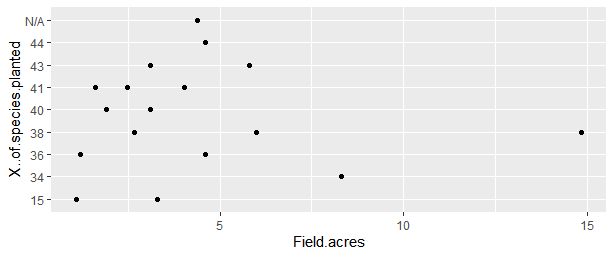
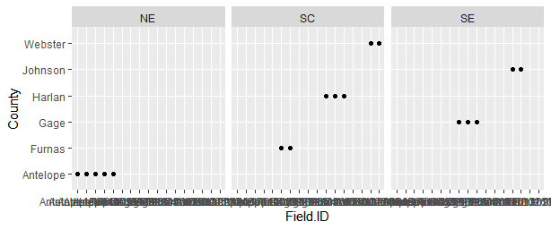
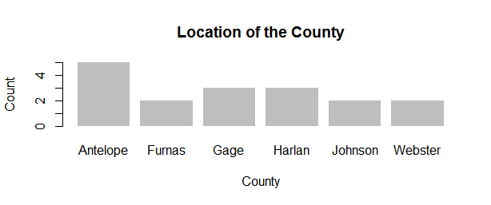

+ ggplot (CRP_DATA, aes(x = Field.acres, y = X..of.species.planted, color = Field.ID))+
+ geom_smooth(method = lm, se = FALSE, fullrange = TRUE)+
+ geom_point()..

+     ggplot(data= CRP_DATA) +
+     geom_point(mapping= aes (x = Field.ID, y=County)) +
+     facet_grid(.~Region)..

+ barplot(County.freq, main ="Location of the County" , xlab = "County", ylab ="Count" , border= NA) ..

+ ggplot(data=CRP_DATA) + geom_point(mapping=aes(x = Field.acres,y = County),color="black")+ geom_smooth (mapping=aes(x= Field.acres,y= County ),color="blue")..

ggplot(data = CRP_DATA)+
  + geom_point(mapping = aes(x = Field.acres, y = X..of.species.planted))..

### Two scatter plots of two different variables, properly labeled

In this picture we see the Filed acres vs species which unfortunately doesn't give us the information I wanted to.  

###  One faceted plot of two variables, properly labeled

Pending investigation 

### One scatter plot of two variables, properly labeled, with a trend
  
Pending investigation 
 
 
